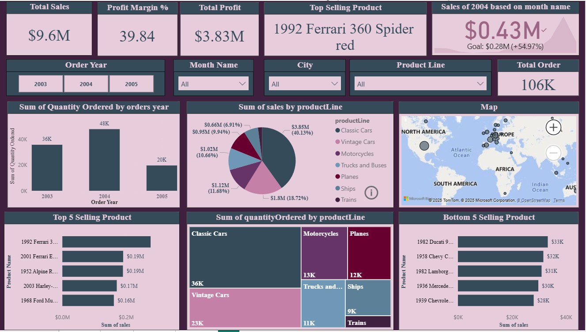

# 🚚 Power BI Global Transport Sales Dashboard

This project is a comprehensive *Transport Sales Analysis Dashboard* built using *Power BI*. It offers deep insights into global transport sales performance, trends, region-wise revenue, and other key metrics to support strategic business decisions.

---

## 🧠 Project Objective

To design an interactive Power BI dashboard that allows users to:

- Analyze global transport sales performance by region and product
- Track revenue growth and sales trends over time
- Identify top-performing countries and transport categories
- Monitor KPIs such as total revenue, profit margin, and sales volume
- Enable business teams to make data-driven decisions with ease

---

## 🛠 Tools & Technologies Used

- *Power BI* – for building interactive and dynamic dashboards  
- *Microsoft Excel* – for data cleaning, transformation, and preprocessing  
- *DAX (Data Analysis Expressions)* – for calculated columns, measures, and KPIs  
- *Power Query Editor* – for data shaping, merging, and filtering  
- *Data Modeling* – to create logical relationships between tables (e.g., region, product, sales)  
- *Time Intelligence Functions* – for analyzing trends like Year-over-Year (YoY) and Month-over-Month (MoM)  
- *Slicers & Filters* – to explore data based on regions, product lines, and timeframes  
- *Bookmarks and Tooltips* – for dynamic storytelling and interactivity  
- *Data Visualization Best Practices* – used to enhance clarity, usability, and user engagement  

---

## 📸 Dashboard Preview

